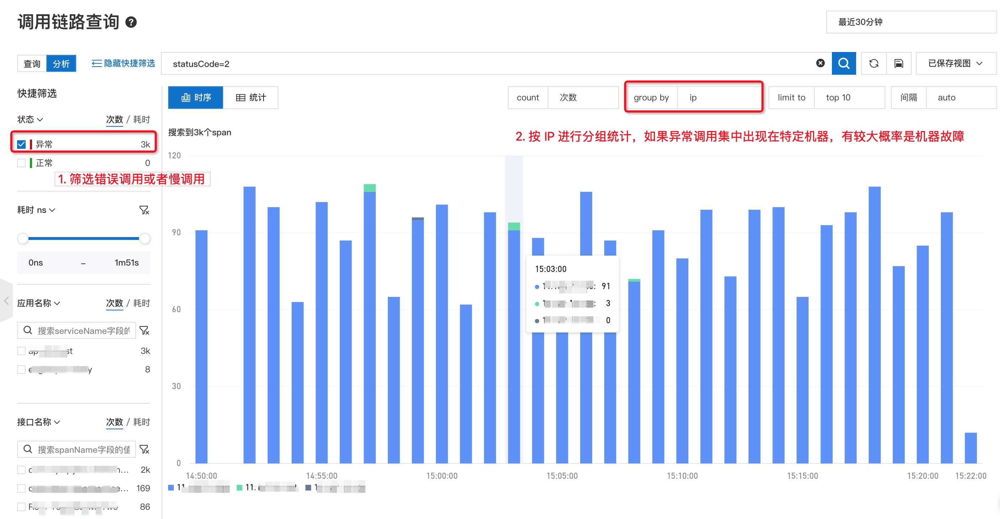

# 链路分析 K.O“五大经典问题”

> 作者：夏明（涯海）    
> 创作日期：2021-11-05  
> 专栏地址：[【稳定大于一切】](https://github.com/StabilityMan/StabilityGuide)  
> PDF 格式：[链路分析K.O“五大经典问题”.md](https://github.com/StabilityMan/StabilityGuide/blob/master/docs/diagnosis/tracing/pdf/链路分析K.O“五大经典问题”.pdf)  

## 链路追踪的“第三种玩法”

提起链路追踪，大家会很自然的想到使用调用链排查单次请求的异常，或使用预聚合的链路统计指标进行服务监控与告警。其实，链路追踪还有第三种玩法：相比调用链，它能够更快的定界问题；相比预聚合的监控图表，它可以更灵活的实现自定义诊断。那就是基于明细链路数据的后聚合分析，简称链路分析。
​

**链路分析是基于已存储的全量链路明细数据，自由组合筛选条件与聚合维度进行实时分析，可以满足不同场景的自定义诊断需求。** 比如，查看耗时大于 3秒的慢调用时序分布，查看错误请求在不同机器上的分布，查看 VIP 客户的流量变化等。接下来本文将介绍如何通过链路分析快速定位五种经典线上问题，更直观的了解链路分析的用法与价值。
​

## 链路分析 K.O“五大经典问题”
基于后聚合的链路分析用法非常灵活，本文仅列举五种最典型的案例场景，其他场景欢迎大家一起探索分享。
### 1. 【流量不均】负载均衡配置错误，导致大量请求打到少量机器，造成“热点”影响服务可用性，怎么办？
流量不均导致的“热点击穿”问题，很容易造成服务不可用，在生产环境中出现过多起这样的案例。比如负载均衡配置错误，注册中心异常导致重启节点的服务无法上线，DHT 哈希因子异常等等。
​

流量不均最大风险在于能否及时发现“热点”现象，它的问题表象更多是服务响应变慢或报错，传统监控无法直观反映热点现象，所以大部分同学都不会第一时间考虑这个因素，从而浪费了宝贵的应急处理时间，造成故障影响面不断扩散。
​

通过链路分析按 IP 分组统计链路数据，快速了解调用请求分布在哪些机器上，特别是问题发生前后的流量分布变化，如果大量请求突然集中在一台或少量机器，很可能是流量不均导致的热点问题。再结合问题发生点的变更事件，快速定位造成故障的错误变更，及时回滚。

### 2. 【单机故障】网卡损坏/CPU 超卖/磁盘打满等单机故障，导致部分请求失败或超时，如何排查？
单机故障每时每刻都在频繁发生，特别是核心集群由于节点数量比较多，从统计概率来看几乎是一种“必然”事件。单机故障不会造成服务大面积不可用，但会造成少量用户请求失败或超时，持续影响用户体验，并造成一定答疑成本，因此需要及时处理这类问题。
​

单机故障可以分为宿主机故障和容器故障两类（在 K8S 环境可以分为 Node 和 Pod）。比如 CPU 超卖、硬件故障等都是宿主机级别，会影响所有容器；而磁盘打满，内存溢出等故障仅影响单个容器。因此，在排查单机故障时，可以根据宿主机 IP 和容器 IP 两个维度分别进行分析。
​

面对这类问题，可以通过链路分析先筛选出异常或超时请求，根据宿主机 IP 或容器 IP 进行聚合分析，快速判断是否存在单机故障。如果异常请求集中在单台机器，可以尝试替换机器进行快速恢复，或者排查该机器的各项系统参数：比如磁盘空间是否已满、CPU steal time 是否过高等。如果异常请求分散在多台机器，那大概率可以排除单机故障因素，可以重点分析下游依赖服务或程序逻辑是否异常。

### 3. 【慢接口治理】新应用上线或大促前性能优化，如何快速梳理慢接口列表，解决性能瓶颈？
新应用上线或大促备战时通常需要做一次系统性的性能调优。第一步就是分析当前系统存在哪些性能瓶颈，梳理出慢接口的列表和出现频率。
​

此时，可以通过链路分析筛选出耗时大于一定阈值的调用，再根据接口名称进行分组统计，这样就可以快速定位慢接口的列表与规律，然后对出现频率最高的慢接口逐一进行治理。
​

找到慢接口后，可以结合相关的调用链、方法栈和线程池等数据定位慢调用根因，常见原因包括以下几类：

- **数据库/微服务连接池过小**， 大量请求处于获取连接状态，可以调大连接池最大线程数解决。
- **N+1 问题**，比如一次外部请求内部调用了上百次的数据库调用，可以将碎片化的请求进行合并，降低网络传输耗时。
- **单次请求数据过大**， 导致网络传输和反序列化时间过长且容易导致 FGC。可以将全量查询改为分页查询，避免一次请求过多数据。
- **日志框架“热锁”**， 可以将日志同步输出改为异步输出。

### 4. 【业务流量统计】如何分析重保客户/渠道的流量变化和服务质量？
在实际生产环境中，服务通常是标准化的，但业务却需要分类分级。同样的订单服务，我们需要按照类目、渠道、用户等维度进行分类统计，实现精细化运营。比如，对于线下零售渠道而言，每一笔订单、每一个 POS 机的稳定性都可能会触发舆情，线下渠道的 SLA 要求要远高于线上渠道。那么，我们如何在通用的电商服务体系中，精准的监控线下零售链路的流量状态和服务质量呢？

在这里，可以使用链路分析的自定义 Attributes 过滤和统计实现低成本的业务链路分析。比如，我们在入口服务针对线下订单打上一个 {"attributes.channel": "offline"} 的标签，然后再针对不同门店、用户客群和商品类目分别打标。最后，通过对 attributes.channel = offline 进行过滤，再对不同的业务标签进行 group by 分组统计调用次数、耗时或错误率等指标，就可以快速的分析出每一类业务场景的流量趋势与服务质量。

### 5. 【灰度发布监控】500台机器分10批发布，如何在第一批灰度发布后，就能快速判断是否有异常？
变更三板斧“可灰度、可监控、可回滚”，是保障线上稳定性的重要准则。其中，分批次灰度变更是降低线上风险，控制爆炸半径的关键手段。一旦发现灰度批次的服务状态异常，应及时进行回滚，而不是继续发布。然而，生产环境很多故障的发生都是由于缺乏有效的灰度监控导致的。

例如，当微服务注册中心异常时，重启发布的机器无法进行服务注册上线。由于缺乏灰度监控，前几批重启机器虽然全部注册失败，导致所有流量都集中路由到最后一批机器，但是应用监控的总体流量和耗时没有显著变化，直至最后一批机器也重启注册失败后，整个应用进入完全不可用状态，最终酿成了严重的线上故障。
​

在上述案例中，如果对不同机器流量进行版本打标  {"attributes.version": "v1.0.x"} ，通过链路分析对attributes.version 进行分组统计，可以清晰的区分发布前后或不同版本的流量变化和服务质量。不会出现灰度批次异常被全局监控掩盖的情况。

## 链路分析的约束条件
链路分析虽然使用起来非常灵活，可以满足不同场景的自定义诊断需求。但是它也有几点使用约束限制：

1. **基于链路明细数据进行分析的成本较高**。 链路分析的前提是尽可能完整的上报并存储链路明细数据，如果采样率比较低导致明细数据不全，链路分析的效果就会大打折扣。为了降低全量存储成本，可以在用户集群内部署边缘数据节点，进行临时数据缓存与处理，降低跨网络上报开销。或者，在服务端进行冷热数据分离存储，热存储进行全量链路分析，冷存储进行错慢链路诊断。
1. **后聚合分析的查询性能开销大，并发小，不适合用于告警**。 链路分析是实时的进行全量数据扫描与统计，查询性能开销要远大于预聚合统计指标，所以不适合进行高并发的告警查询。需要结合自定义指标功能将后聚合分析语句下推至客户端进行自定义指标统计，以便支持告警与大盘定制。
1. **结合自定义标签埋点，才能最大化释放链路分析价值**。 链路分析不同于标准的应用监控预聚合指标，很多自定义场景的标签需要用户手动埋点打标，这样才能最有效的区分不同业务场景，实现精准分析。

## 推荐产品
- 阿里云 ARMS Trace —— 2021 年 Gartner APM 魔力象限中国唯一入选云厂商([https://help.aliyun.com/document_detail/42781.html)](https://help.aliyun.com/document_detail/42781.html))

## 推荐社区
【稳定大于一切】打造国内稳定性领域知识库，**让无法解决的问题少一点点，让世界的确定性多一点点。**

- GitHub 专栏地址 ([https://github.com/StabilityMan/StabilityGuide)](https://github.com/StabilityMan/StabilityGuide))
- 钉钉交流群号：30000312
- 如果阅读本文有所收获，欢迎分享给身边的朋友，期待更多同学的加入！

